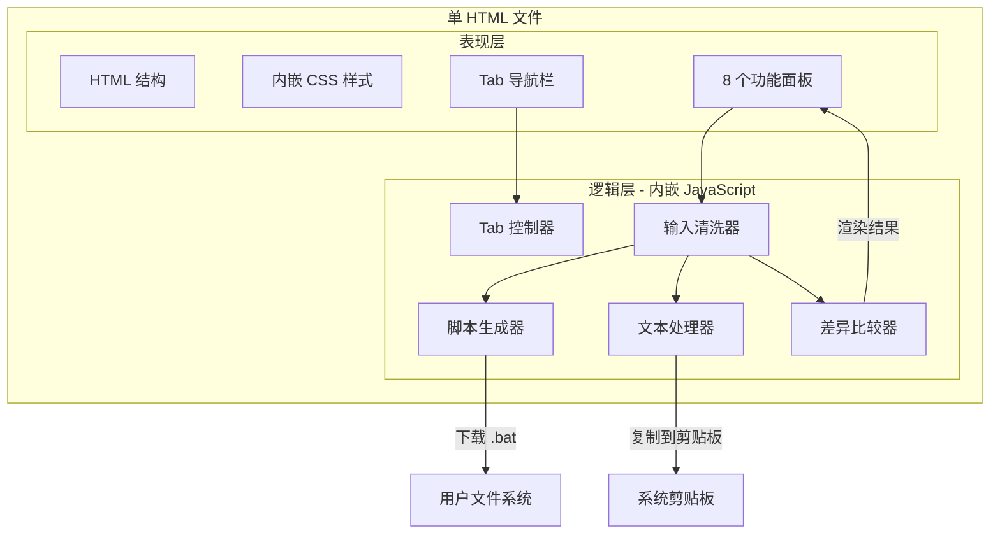

# 技术设计文档

## 概述

实用工具箱是一个单 HTML 文件的本地工具集，面向无技术背景用户。整个应用以单文件形式交付（`E:\tools\toolbox.html`），内嵌所有 CSS 样式和 JavaScript 代码，零外部依赖，双击浏览器打开即可离线使用。

工具箱包含 8 个功能面板，通过顶部 Tab 导航切换：
1. 批量创建文件夹
2. 批量创建文件
3. 批量重命名文件
4. 批量重命名文件夹
5. 批量修改扩展名
6. 文本对比（LCS 算法）
7. 文本去重
8. 文本排序

文件系统操作通过生成 `.bat` 脚本实现，用户下载后双击执行。文本处理操作（对比、去重、排序）在浏览器内完成，结果可一键复制。

### 设计决策

1. **单文件交付**：所有 HTML、CSS、JS 直接手写在一个 HTML 文件中，无需构建流程。文件体量可控（8 个功能面板），直接维护单文件比引入构建系统更简单。
2. **纯原生 JS**：不使用任何框架或库，确保零依赖、离线可用、文件体积小。
3. **`.bat` 脚本方案**：浏览器无法直接操作文件系统，通过生成 Windows `.bat` 脚本间接实现文件操作，用户下载后手动执行。
4. **LCS 差异算法**：文本对比采用经典 LCS（最长公共子序列）算法，支持行级和字符级差异分析，无需引入外部 diff 库。

## 架构

### 整体架构



### 文件结构

项目无构建流程，直接维护单个 HTML 文件：

```
E:\tools\toolbox.html    ← 唯一交付物，直接手写维护
```

文件内部结构：
```html
<!DOCTYPE html>
<html lang="zh-CN">
<head>
  <meta charset="UTF-8">
  <title>实用工具箱</title>
  <style>
    /* 全部 CSS 样式 */
  </style>
</head>
<body>
  <!-- Tab 导航栏 -->
  <!-- 8 个功能面板 HTML -->
  <script>
    /* 全部 JavaScript 逻辑 */
  </script>
</body>
</html>
```

### 功能分类

| 类别 | 功能 | 输出方式 |
|------|------|----------|
| 文件操作类 | 批量创建文件夹、批量创建文件、批量重命名文件、批量重命名文件夹、批量修改扩展名 | 生成 `.bat` 脚本下载 |
| 文本处理类 | 文本对比、文本去重、文本排序 | 页面内展示 + 复制到剪贴板 |

## 组件与接口

### 1. Tab 控制器（TabController）

负责功能面板的切换显示。

```javascript
/**
 * 切换到指定索引的功能面板
 * @param {number} idx - 面板索引（0-7）
 */
function switchTab(idx)
```

**行为**：
- 遍历所有 `.tab-btn`，为第 `idx` 个添加 `active` 类，其余移除
- 遍历所有 `.panel`，为第 `idx` 个添加 `active` 类，其余移除
- 默认加载时 `idx=0`（批量创建文件夹）

### 2. 输入清洗器（InputSanitizer）

对用户输入文本进行预处理。

```javascript
/**
 * 解析多行文本，执行 Tab→换行转换、去空行、去首尾空格、去重
 * @param {string} text - 用户输入的原始文本
 * @returns {string[]} - 清洗后的非空、不重复行数组
 */
function parseLines(text)
```

**处理流程**：
1. 将 Tab 字符（`\t`）替换为换行符（`\n`）
2. 按换行符拆分为数组
3. 对每行执行 `trim()` 去首尾空格
4. 过滤空行
5. 使用 `Set` 去重，保留首次出现顺序

### 3. 脚本生成器（ScriptGenerator）

生成 `.bat` 脚本并触发浏览器下载。

```javascript
/**
 * 生成 .bat 脚本头部（@echo off + chcp 65001）
 * @returns {string} - 脚本头部内容
 */
function batHeader()

/**
 * 生成 .bat 脚本尾部（echo 操作完成 + pause）
 * @returns {string} - 脚本尾部内容
 */
function batFooter()

/**
 * 触发浏览器下载 .bat 文件
 * @param {string} filename - 下载文件名
 * @param {string} content - 文件内容
 */
function downloadBat(filename, content)

/**
 * 生成批量创建（文件夹/文件）的 .bat 脚本
 * @param {string} type - 'folders' 或 'files'
 */
function generateCreateBat(type)

/**
 * 生成批量重命名的 .bat 脚本
 * @param {string} type - 'file' 或 'dir'
 */
function generateRenameBat(type)

/**
 * 生成批量修改扩展名的 .bat 脚本
 */
function generateExtBat()
```

**脚本结构**：
```
@echo off
chcp 65001 >nul
{具体命令...}
echo.
echo 操作完成！
pause
```

**特殊字符处理**：所有文件名/文件夹名使用双引号包裹，防止特殊字符（`&`、`|`、`>`、`<`）导致脚本语法错误。

### 4. 重命名计算器（RenameCalculator）

计算重命名前后的映射关系。

```javascript
/**
 * 根据当前选择的模式和参数，计算重命名映射对
 * @param {string} type - 'file' 或 'dir'
 * @returns {Array<[string, string]>} - [原名, 新名] 映射对数组
 */
function computeRenamePairs(type)
```

**支持的模式**：
- **查找替换（replace）**：对每个名称执行字符串替换
- **添加前缀/后缀（affix）**：文件模式下后缀插入到扩展名前；文件夹模式下直接追加
- **序号编号（number）**：支持起始号、步长、位数配置，文件模式下序号替换文件名主体保留扩展名

### 5. 差异比较器（DiffComparator）

基于 LCS 算法的文本对比引擎。

```javascript
/**
 * 计算两个序列的 LCS 动态规划矩阵
 * @param {Array} a - 序列 A
 * @param {Array} b - 序列 B
 * @returns {number[][]} - DP 矩阵
 */
function lcsMatrix(a, b)

/**
 * 回溯 DP 矩阵，生成差异操作序列
 * @param {number[][]} dp - DP 矩阵
 * @param {Array} a - 序列 A
 * @param {Array} b - 序列 B
 * @returns {Array<{type: string, leftIdx?: number, rightIdx?: number}>}
 */
function backtrackDiff(dp, a, b)

/**
 * 对两个字符串进行字符级差异分析
 * @param {string} oldStr - 原始字符串
 * @param {string} newStr - 修改后字符串
 * @returns {{oldParts: Array, newParts: Array}} - 带高亮标记的字符数组
 */
function charDiff(oldStr, newStr)

/**
 * 执行完整的文本对比流程
 * 1. 行级 LCS 对比
 * 2. 相邻 del+add 合并为 mod（修改行）
 * 3. 对 mod 行执行字符级差异分析
 */
function runDiff()

/**
 * 渲染差异结果到页面，支持"仅显示差异行"过滤
 */
function renderDiff()
```

**差异类型**：
- `equal`：相同行，白色背景
- `del`：删除行，红色背景（`#ffeef0`）
- `add`：新增行，绿色背景（`#e6ffed`）
- `mod`：修改行，黄色背景（`#fff8e1`），行内差异字符用 `<span class="hl">` 高亮

### 6. 文本处理器（TextProcessor）

处理文本去重和排序。

```javascript
/**
 * 执行文本去重，保留首次出现顺序
 * 支持"忽略大小写"模式
 */
function runDedup()

/**
 * 执行文本排序
 * 支持正序/倒序、按字母/按数字模式
 * 按数字模式下非数字行排在数字行之后
 */
function runSort()

/**
 * 将指定文本框内容复制到系统剪贴板
 * @param {string} id - 文本框元素 ID
 */
function copyResult(id)
```

### 7. HTML 转义工具

```javascript
/**
 * 转义 HTML 特殊字符，防止 XSS
 * @param {string} s - 原始字符串
 * @returns {string} - 转义后的安全字符串
 */
function escapeHtml(s)
```

## 数据模型

本项目为纯前端单页应用，无持久化存储，所有数据存在于 DOM 和 JavaScript 变量中。

### 核心数据结构

#### 1. 清洗后的行数组
```typescript
// parseLines 的返回值
type CleanedLines = string[]  // 去重、去空、去首尾空格后的行数组
```

#### 2. 重命名映射对
```typescript
// computeRenamePairs 的返回值
type RenamePair = [string, string]  // [原名, 新名]
type RenamePairs = RenamePair[]
```

#### 3. 差异操作序列
```typescript
// backtrackDiff 的返回值
type DiffOp = 
  | { type: 'equal'; leftIdx: number; rightIdx: number }
  | { type: 'del'; leftIdx: number }
  | { type: 'add'; rightIdx: number }
  | { type: 'mod'; leftIdx: number; rightIdx: number; oldHtml: string; newHtml: string }
```

#### 4. 字符级差异标记
```typescript
// charDiff 的返回值
type CharPart = { ch: string; hl: boolean }  // hl=true 表示该字符有差异
type CharDiffResult = {
  oldParts: CharPart[]
  newParts: CharPart[]
}
```

#### 5. .bat 脚本结构
```
┌─────────────────────────┐
│ @echo off               │  ← batHeader()
│ chcp 65001 >nul         │
├─────────────────────────┤
│ mkdir "文件夹1"          │  ← 具体命令（因功能而异）
│ mkdir "文件夹2"          │
│ ...                     │
├─────────────────────────┤
│ echo.                   │  ← batFooter()
│ echo 操作完成！          │
│ pause                   │
└─────────────────────────┘
```

#### 6. 面板状态（DOM 驱动）

每个功能面板的状态完全由 DOM 元素承载，无独立的状态对象：

| 面板 | 输入元素 | 输出元素 |
|------|----------|----------|
| 批量创建文件夹 | `#folders-input` | `#folders-preview` |
| 批量创建文件 | `#files-input` | `#files-preview` |
| 批量重命名文件 | `#rename-file-input` + 模式参数 | `#rename-file-preview` |
| 批量重命名文件夹 | `#rename-dir-input` + 模式参数 | `#rename-dir-preview` |
| 批量修改扩展名 | `#ext-old`, `#ext-new` | `#ext-preview` |
| 文本对比 | `#diff-left`, `#diff-right` | `#diff-result` |
| 文本去重 | `#dedup-input` | `#dedup-output`, `#dedup-stats` |
| 文本排序 | `#sort-input` | `#sort-output` |


## 正确性属性

*正确性属性是在系统所有有效执行中都应成立的特征或行为——本质上是对系统应做什么的形式化陈述。属性是人类可读规格说明与机器可验证正确性保证之间的桥梁。*

### Property 1: 输入清洗的完整性

*For any* 输入字符串（可能包含 Tab 字符、空行、重复行、首尾空格），`parseLines` 的返回结果应满足：
1. 不包含空字符串
2. 不包含重复元素
3. 每个元素均无首尾空格
4. Tab 字符被视为换行符处理（即 `parseLines("a\tb")` 与 `parseLines("a\nb")` 返回相同结果）

**Validates: Requirements 3.2, 3.3, 4.2, 4.3**

### Property 2: 文件夹创建脚本的正确性

*For any* 非空的文件夹名称列表，`generateCreateBat('folders')` 生成的 `.bat` 脚本应满足：
1. 每个文件夹名称对应恰好一条 `mkdir` 命令
2. 每个文件夹名称被双引号包裹
3. 每条 `mkdir` 命令前有 `if not exist` 判断
4. 脚本以 `@echo off` 和 `chcp 65001` 开头

**Validates: Requirements 3.5, 3.6, 3.8, 11.1, 11.2**

### Property 3: 文件创建脚本的正确性

*For any* 非空的文件名列表，`generateCreateBat('files')` 生成的 `.bat` 脚本应满足：
1. 每个文件名对应恰好一条创建空文件命令
2. 每个文件名被双引号包裹
3. 每条创建命令前有 `if not exist` 判断
4. 脚本以 `@echo off` 和 `chcp 65001` 开头

**Validates: Requirements 4.5, 4.6, 4.8, 11.1, 11.2**

### Property 4: 查找替换重命名的正确性

*For any* 名称列表和任意查找/替换字符串对，`computeRenamePairs` 在 `replace` 模式下返回的每个映射对 `[原名, 新名]` 应满足：新名等于原名中所有查找字符串出现位置被替换为替换字符串后的结果。

**Validates: Requirements 5.2, 6.2**

### Property 5: 前缀后缀重命名的正确性

*For any* 名称列表和任意前缀/后缀字符串，`computeRenamePairs` 在 `affix` 模式下返回的每个映射对应满足：
- 文件模式（type='file'）：新名以前缀开头，后缀插入在最后一个 `.` 之前（扩展名之前）
- 文件夹模式（type='dir'）：新名等于 `前缀 + 原名 + 后缀`

**Validates: Requirements 5.3, 6.3**

### Property 6: 序号编号重命名的正确性

*For any* 名称列表和任意编号参数（起始号 start、步长 step、位数 digits），`computeRenamePairs` 在 `number` 模式下返回的第 i 个映射对的新名中应包含值为 `start + i * step` 的序号，且序号用零填充至指定位数。

**Validates: Requirements 5.4, 6.4**

### Property 7: LCS 行级差异的正确性（Round-Trip）

*For any* 两个字符串数组 A 和 B，`backtrackDiff(lcsMatrix(A, B), A, B)` 返回的操作序列应满足：按顺序应用所有操作后，从 A 可以重建出 B。具体地：
- 所有 `equal` 操作引用的 A[leftIdx] 应等于 B[rightIdx]
- 收集所有 `equal` 和 `add` 操作的右侧索引对应的 B 元素，按顺序应等于 B

**Validates: Requirements 8.2**

### Property 8: 字符级差异的重建性（Round-Trip）

*For any* 两个字符串 oldStr 和 newStr，`charDiff(oldStr, newStr)` 返回的结果应满足：
- `oldParts` 中所有字符按顺序拼接应等于 `oldStr`
- `newParts` 中所有字符按顺序拼接应等于 `newStr`

**Validates: Requirements 8.3**

### Property 9: 文本去重的正确性

*For any* 文本行列表，去重操作应满足：
1. 结果中无重复行
2. 结果中每个元素都存在于原始输入中
3. 结果保持首次出现的相对顺序
4. 当"忽略大小写"开启时，结果中不存在两行仅大小写不同的情况，且保留首次出现的原始大小写

**Validates: Requirements 9.2, 9.3**

### Property 10: 文本排序的正确性

*For any* 文本行列表，排序操作应满足：
1. 结果是输入中非空行的一个排列（元素相同，仅顺序不同）
2. 结果中不包含空行
3. 正序模式下，结果中每个元素 ≤ 下一个元素（按所选比较方式）
4. 倒序模式下，结果中每个元素 ≥ 下一个元素
5. 按数字排序模式下，所有可解析为数字的行排在非数字行之前

**Validates: Requirements 10.4, 10.5**

### Property 11: 扩展名修改脚本的正确性

*For any* 有效的原扩展名和新扩展名对，`generateExtBat` 生成的脚本应包含 `ren *原扩展名 *新扩展名` 命令，且扩展名以 `.` 开头（自动补全）。

**Validates: Requirements 7.3**

## 错误处理

### 输入验证

| 场景 | 处理方式 | 相关需求 |
|------|----------|----------|
| 名称列表为空 | 禁用"生成脚本"按钮，`alert()` 提示用户输入内容 | 11.3 |
| 扩展名输入为空 | 禁用"生成脚本"按钮，提示补全输入 | 7.5 |
| 查找替换模式下查找文本为空 | `alert()` 提示用户输入查找内容 | 5.2 |
| 文本对比两侧均为空 | 显示空状态提示"请先输入文本并点击对比" | 8.2 |

### 特殊字符处理

- **文件名中的 bat 特殊字符**（`&`、`|`、`>`、`<`、`"`）：所有文件名/文件夹名使用双引号包裹，确保 `.bat` 脚本语法正确（需求 11.1, 11.2）
- **HTML 注入防护**：所有用户输入在渲染到页面前通过 `escapeHtml()` 转义 `&`、`<`、`>`、`"` 字符
- **扩展名自动补点**：如果用户输入的扩展名不以 `.` 开头，自动补全

### 剪贴板操作

- 优先使用 `navigator.clipboard.writeText()` API
- 降级方案：`document.execCommand('copy')`
- 两种方式均通过 `alert()` 通知用户复制结果

### 边界情况

| 场景 | 处理方式 |
|------|----------|
| 输入全为空行/空格 | `parseLines` 返回空数组，禁用生成按钮 |
| 输入全为重复行 | `parseLines` 去重后仅保留一行 |
| 文件名无扩展名（affix 模式） | 直接在末尾追加后缀，不做扩展名分割 |
| 数字排序中的非数字行 | `parseFloat` 返回 `NaN` 时使用 `0` 作为排序值，排在数字行之后 |
| 超长文本输入 | 预览区设置 `max-height` + `overflow-y: auto` 滚动显示 |

## 测试策略

### 测试方法

本项目为单 HTML 文件工具箱，采用**手动功能测试 + 浏览器控制台验证**的轻量方案，不引入 Node.js 测试框架。

### 手动测试清单

#### 文件操作类功能（5 个）

| 测试项 | 测试步骤 | 预期结果 |
|--------|----------|----------|
| 批量创建文件夹 | 输入含 Tab、空行、重复行的文本 → 点击生成 | 预览去重正确；下载的 bat 包含 `mkdir` + `if not exist`；双击执行创建成功 |
| 批量创建文件 | 输入含扩展名的文件名列表 → 点击生成 | 预览去重正确；下载的 bat 包含 `type nul >` + `if not exist`；双击执行创建成功 |
| 批量重命名文件 | 分别测试直接映射、查找替换、前缀后缀、序号编号 | 预览对比正确；bat 中 `ren` 命令正确 |
| 批量重命名文件夹 | 同上，针对文件夹 | 同上 |
| 批量修改扩展名 | 输入 `.jpeg` → `.jpg` | 预览显示 `*.jpeg → *.jpg`；bat 命令正确 |

#### 文本处理类功能（3 个）

| 测试项 | 测试步骤 | 预期结果 |
|--------|----------|----------|
| 文本对比 | 输入两段有差异的文本 → 点击对比 | 新增行绿色、删除行红色、修改行黄色；行内差异字符高亮；"仅差异行"过滤正常 |
| 文本去重 | 输入含重复行的文本 → 点击去重 | 去重结果正确；行数统计正确；忽略大小写模式正常；一键复制成功 |
| 文本排序 | 输入乱序文本 → 分别测试正序/倒序、字母/数字 | 排序结果正确；空行被去除；非数字行排在数字行之后；一键复制成功 |

#### 通用功能

| 测试项 | 测试步骤 | 预期结果 |
|--------|----------|----------|
| Tab 切换 | 依次点击 8 个标签 | 面板正确切换，高亮跟随 |
| 清空按钮 | 输入内容后点击清空 | 输入区和预览区全部重置 |
| 空输入保护 | 不输入内容直接点击生成 | 按钮禁用或弹出提示 |
| 特殊字符 | 输入含 `&`、`|`、`>`、`<` 的文件名 | bat 脚本语法正确，双引号包裹 |
| 中文兼容 | 输入中文文件名/文件夹名 | bat 脚本含 `chcp 65001`，执行无乱码 |
| 下载文件名 | 生成脚本并下载 | 文件名格式为 `{功能名称}_{日期}.bat` |
| bat 执行反馈 | 双击执行下载的 bat | 窗口显示"操作完成！"并暂停等待按键 |

### 浏览器控制台验证

对于核心纯函数，可在浏览器控制台直接调用验证：

```javascript
// 验证 parseLines
console.assert(parseLines("a\tb\n\nc\na").length === 3)
console.assert(parseLines("  hello  \n  hello  ").length === 1)

// 验证 LCS diff
var ops = backtrackDiff(lcsMatrix(["a","b"], ["a","c"]), ["a","b"], ["a","c"])
console.assert(ops.length === 3) // equal + del + add

// 验证 charDiff round-trip
var r = charDiff("hello", "hallo")
console.assert(r.oldParts.map(p=>p.ch).join('') === "hello")
console.assert(r.newParts.map(p=>p.ch).join('') === "hallo")
```
